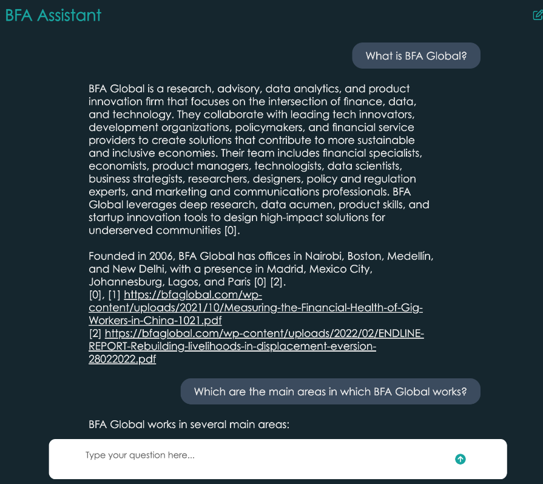

# Objectives of the BFA Global Chatbot
This project presents the developments of an internal BFA Chatbot using a Retrieval Augmented Generation (RAG) system.    
The objectives of the system are:
* Increase adoption of employees of GenAi technologies
* Allow employees to Interrogate BFA Global Knowledge

# Components of the solution

## Technology Stack

- **Frontend**: HTML, CSS, JavaScript
- **Backend**: Python Flask
- **API**: OpenAI's Assistant API
## Schema

## Features

- Function calling.
- Create new chat threads.
- Send messages and receive assistant responses.
- Display conversation history.
- Context history from previous q&a's
- Modern and responsive user interface (gpt like)
- provide formatted references to pdfs and posts sources

### Prerequisites

- Python 3
- Flask
- OpenAI API key
- OpenAI Assistants: id and vector store

## Curated knowledge Base
The knowledge base is include [here](https://drive.google.com/drive/u/0/folders/1S4vsu0UOW9STJup4RmxnhXHkpCsf0db1)
The knowledge base includes the following resources from the following sources
The detailed analysis of the sources is included [here](https://docs.google.com/spreadsheets/d/1UzleRt6p7qcWYlL1COdFDRfsfuEcXedYj_k8ieJ0yhk/edit#gid=2076294313)
* BFA GLOBAL webpage:    
508 reports.   
1000 blogpost.   
* CIFAR webpage.   
46 reports.   
11 posts (the rest are links to external sites).   
* Hippocampus information
Information from 300 projects has been included.
The following entries have been removed: confidencial projects, projects without SOQ.   

The following sources have been considered but not included in this version:    
* CATALYST FUND. Not included.   
* JOBTECH ALLIANCE. Not included.   
* Youtube. There is Potential in including the transcriptions
* Project information. This information would be very valuable as it contains the findings but would require selection of the deliverables (together with PMs) as the information included in google drive is not curated.

### Limitations for the knowledge base
In most of cases the SOQ information does not contain the findings but only a high level description of the scope
of the project as this was defined at the beginning
Information about proposals and deliverables are not consistently stored in drive (even in the specific private folders) Joint work with PLs should be done to include this information.

## OpenAI Assistant
### Screenshot of the Assistants UI

Assistants is a tool from OpenAI that allows to create RAG systems using a UI  via [playground](https://platform.openai.com/playground) or programatically using the API.   
This tool allows to easily create a powerful backend.   
It currently supports up to 10,000 files x 5000000 tokens -> over 100B characters.
Most of OpenAI models including those capable of analyzing files and code
Allows integration with any frontend.        
Two assistants were created:
* PRE: DEV_BFA Global Knowledge Base.
* PRO: PRO_BFA Global Knowledge Base.    

To configure the assistants the following information needs to be configured:
* Name.    
* Instructions.     
Answer the question based only on the context in the flles. If you can answer the question, respond with the answer. If you cannot answer the question with the context, try to answer based on general information if you are confident you know the answer, and respond with "I couldn't find the answer in BFA's content but based on my own knowledge" followed by the answer. If also you don't have the answer please respond with "I don't know".   
If the user asks about BFA work or projects, work step by step:
1.  If the user has included a reference to a country or region in the conversation, focus on that country or region.
2. If not, retrieve as many projects as possible
3. Present information include: name of the project and year.
4. Ask the user to choose one and then present a brief description.
If the user ask about publications, focus on the most recent publications, provide up to five results including for each of those the title of the publication (not the title of the project) and include information that can help the user find the sources.
* Model: gpt-4o    
* File search: On
* Code Interpreter: Off
* JSON object: Off
* Temperature: 0.01
* Top P: 0.49

In addition to that a vector store needs to be configured.

### Vector Store
Only one vector Store was created.
Both Assistants point to the same vector store.
The vector store was created using the UI which provides limited funtiuonalities to manage it.
The vector store has now a size of 104 Mb.   
The additional configuration is provided:
* Expiration Policy: Never
* Expires: Never.

The inventory of the files currently included in the vector store is [here](https://docs.google.com/spreadsheets/d/1Ll6QGjOReswx73jSJ3uOlC4NMYYHsOpjlQ6kE9n3Ln8/edit#gid=1296088045)

## Library to provide links in references
The output of the assistants includes references to the file names included in the vector store, but this references are not clickable.
Also, in certain cases it provides many references to the same file which makes the output redundant.
To avoid this redundancy and to allow the users to navigate to the specific content a library was created to process the output of the LLM and adapt it before showing it in the Graphical User Interface.    
The correspondence between the filename and the url is stored in the [**data**](https://github.com/BalsaMartin/BFA_Assistants/tree/main/data) folder.    
This folder includes csvs to map the content to the url depending on the source of the file and the type of content.    
* BFA_final_master_pdfs_ok_db. Includes the mapping to the posts and the pdfs linked in the BFA website.
* CifarWIX_master_pdfs_ok_db. Includes the mapping to the posts and pdfs linked in the CIFAR webpage.
* For SOQ information on projects, we provide the link to the shared spreadsheet and the project code.

The code can be found in the index.py file

## Graphical User Interface
The UI is a simple webpage that allows the user to:
* Ask a question to the BFA Knowledge base
* Continue the conversation with the chatbot
* Create a new conversation

screenshot of the UI

The code of the UI is included in the file [script.js](https://github.com/BalsaMartin/BFA_Assistants/blob/main/static/script.js)

# Setting up Vercel environment

To host the app in Vercel, there are several steps:
- Link github repository: there's a standard folder structure and filennames that have to be used for Vercel to properly execute the app
- add enviroment variables
- purchase the first commercial tier of Vercel: the free version has an API calls timeout of 10 secs, this is not enough for the current Asssistants API.

  
## Link github repository

https://vercel.com/docs/deployments/git/vercel-for-github

1. Youll have to login on github
2. connect
3. select the correct branches for main (prod) y preview (dev)

## Add environment variables

https://vercel.com/docs/projects/environment-variables

To hide all the api keys and important credentials, we use the Vercel environment variables. 

There are some variables that both main and preview use, and others that are specific to each development environment, like:
- ASsistnats id: we have 1 for each to be able to iterate and compare changes
- OpenAI Api key: not used but could be helpful to control spend per environment

## Import necessary modules

To add libraries to the project you have to add a line to the requirements.txt file. The current content of the file is: 

Flask==3.0.0
weaviate-client
openai 

## Running and updating Vercel app

To update the app you just have to make changes to repository (either dev or main) and an automatic deployment of Vercel will be triggered. After 30-60 secs the app will be up and ready for testing. 

The links to the app are: 
- dev: https://bfa-chatbot-dev.vercel.app/
- prod: https://bfa-chatbot.vercel.app/

You can see the current status of the deployments in the deployments tab. From there you can go to the git commit, debug errors in the deployment and directly open the app in that specific commit. 

https://vercel.com/docs/deployments/overview

## Debugging the app

For the UI you can log messages to the console from the HTML and CS code.

For the python server you can print messages and they'll be showned in the Logs tab of Vercel: https://vercel.com/docs/observability/runtime-logs

## Vercel Local deployment

https://vercel.com/docs/deployments/overview

To run the project locally for faster iteration you have to execute one of these lines of code:

- dev: vercel dev
- main: vercel

Before you can run it locally, you will have to install some dependencies locally (see previous vercel doc url for details)

Currently getting an error, so local deployment is not working:

Error: Builder exited with SIGABRT before sending build result
    at ChildProcess.onExit2 (/Users/Koldan/.nvm/versions/node/v22.2.0/lib/node_modules/vercel/dist/index.js:165050:21)
    at ChildProcess.emit (node:events:532:35)
    at ChildProcess.emit (node:domain:488:12)
    at maybeClose (node:internal/child_process:1105:16)
    at ChildProcess._handle.onexit (node:internal/child_process:305:5)
> Building @vercel/python@latest:api/index.py

# Evaluation of the performance
The solution was evaluated by analyzing the answers provided to questions from 7 different people.    
The evaluation was done with the following approach:    
* The seven users tested the system during the same time.
* The seven users were asked to provide their inputs and insights in the following [form](https://docs.google.com/forms/d/e/1FAIpQLSdGRAX4gKjMLd0QVZyKc3QIY42NbyA-n8ToW-5EhzNm9tWE2g/viewform).
* The seven users were requested to send any unexpected behavious/error by email or slack to the development team.
* The development team analyzed all the results with special attention to the errors submitted by the users

The responses to the survey are [here](https://docs.google.com/forms/d/1kDCfSx5dBQ_vBV0yAsyeFH4PRkXwXo14eLO-tL_NjWs/edit#responses).   
The analysis of the questions is included [here](https://docs.google.com/spreadsheets/d/1QMUYpUnTZHmgRDc_q5CQzX0YfuWjwEtgatRcgxA978Y/edit#gid=525634224)

# Maintenance of the solution

## Adding new knowledge from the existing sources (CIFAR and BFA Global webpage)
To add new knowledge to the knowledge base is very simple.
This can be done in two simple steps:     
1) Adding new files to the vector store using the UI of Assistants provided by OpenAI.   
2) Updating the corresponding file in the data folder. To allow to retrieve the correspondence between the filename of the content added and the url in which this content is located in the webpage.

## FUTURE: Adding new sources (ie: Catalyst Fund)
To add new sources, the information from the new source can be adapted to one of the existing sources (CIFAR, BFA Global webpage) or a new source can be included by modifying the code: The process would include the following steps.     
1. Retrieve all the content from the desired source.
2. Create a csv file with the same internal structure as those that can be find in the data folder.
3. Rename the file to give it an appropriate structure
4. Modify the code in:    
`fetch_url_from_filename(filename, list_bfa, list_cifar) `.   
to include a new list with the info from the new source.
5. Modify how to handle the strings for the new source in the same function

## Correcting/Improving the behaviour of the chatbot
This section includes the learnings when solving erroneous answers in the system.     
When adressing an error it might be useful to go through the following process
1. Is the answer included in the knowledge base?
If the answer is not included, add a new file with the answer and reference public information in the data files to provide a source.
2. Is the answer provided in a wrong format?
Modify the instructions in the assistant to addrees this. This can be useful to show more or less results.
3. Was this an unexpected behavior from the user?
Only address those if they are very common. Solving a problem that might never happen again might affect the rest of the users.

After solving problems, run recursive tests to make sure you do not break other components of the system.    
The following [checklist](https://docs.google.com/spreadsheets/d/1Z3z3nyszS1f_47iB5DMpdIqeeZN1140ezC5Fe_5wr1E/edit#gid=0) might be useful for this.
Remember to document the version control changes and have a backup.   

## Adding new use cases
Additional use cases might be added to the chatbot such as supporting with proposal writing and identified learnings and pitfalls from past projects.      
This would requiring including additional sources as well as refining the intructions to allow the chatbot to cover those use cases.

## Acknowledgements

This project uses code from the [OpenAI Assistant Interface] (https://github.com/IsJustJason/openai-assistants-ui) by IsJustJason, licensed under the MIT License.

